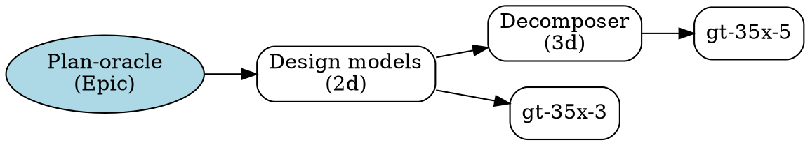

# Plan-Oracle Plugin Design

**Document Version:** 1.0
**Status:** Draft
**Date:** 2026-01-28
**Author:** System Architect
**Issue:** gt-35x

## Executive Summary

The **plan-oracle** plugin provides intelligent analysis of work items and planning documents to support work decomposition, dependency analysis, effort estimation, and optimal execution ordering. It leverages historical patterns, code complexity metrics, and cross-rig coordination requirements to provide actionable planning guidance.

**Key Capabilities:**
- Work decomposition (epics → features → tasks)
- Dependency analysis and visualization
- Effort estimation based on historical patterns
- Execution ordering recommendations
- Risk identification and mitigation suggestions
- Parallelization opportunity detection

## Architecture Overview

### High-Level Design

```
┌─────────────────────────────────────────────────────────────┐
│                    Plan Oracle Plugin                        │
│                    (gt plan-oracle)                          │
└────────────┬────────────────────────────────────────────────┘
             │
    ┌────────┼────────┬─────────┬─────────┬─────────────┐
    │        │        │         │         │             │
    ▼        ▼        ▼         ▼         ▼             ▼
┌────────┐ ┌───┐  ┌───────┐ ┌──────┐ ┌──────────┐ ┌──────┐
│Decomp. │ │Ana│  │Order  │ │Estim.│ │Visualize │ │Risk  │
│        │ │lyz│  │       │ │      │ │          │ │      │
└───┬────┘ └─┬─┘  └───┬───┘ └──┬───┘ └────┬─────┘ └──┬───┘
    │        │        │        │          │          │
    └────────┼────────┴────────┴──────────┴──────────┘
             │
             ▼
    ┌────────────────────────────────────┐
    │      Data Sources                  │
    │  ┌──────────────────────────────┐  │
    │  │ Beads Database               │  │
    │  │ (.beads/issues.jsonl)        │  │
    │  └──────────────────────────────┘  │
    │  ┌──────────────────────────────┐  │
    │  │ Planning Documents           │  │
    │  │ (harness/docs/research/)     │  │
    │  └──────────────────────────────┘  │
    │  ┌──────────────────────────────┐  │
    │  │ Historical Metrics           │  │
    │  │ (.beads/metrics/)            │  │
    │  └──────────────────────────────┘  │
    │  ┌──────────────────────────────┐  │
    │  │ Codebase Analysis            │  │
    │  │ (via static analysis)        │  │
    │  └──────────────────────────────┘  │
    └────────────────────────────────────┘
```

### Component Architecture

```
plan-oracle/
├── analyzer/           # Core analysis engines
│   ├── decomposer.go   # Work breakdown logic
│   ├── dependency.go   # Dependency graph analysis
│   ├── estimator.go    # Effort estimation
│   ├── ordering.go     # Execution order optimization
│   └── risk.go         # Risk assessment
├── models/             # Data models
│   ├── workitem.go     # Enhanced work item model
│   ├── plan.go         # Plan representation
│   └── metrics.go      # Historical metrics
├── sources/            # Data source adapters
│   ├── beads.go        # Beads database reader
│   ├── planning.go     # Planning doc parser
│   └── metrics.go      # Metrics collector
├── visualizer/         # Graph generation
│   ├── dot.go          # DOT format generator
│   └── text.go         # Text-based graphs
└── cmd/                # CLI commands
    ├── decompose.go
    ├── analyze.go
    ├── order.go
    ├── estimate.go
    └── visualize.go
```

## Data Models

### Enhanced Work Item

```go
// WorkItem extends beads.Issue with planning metadata
type WorkItem struct {
    // Core fields from beads.Issue
    ID          string
    Title       string
    Description string
    Status      string
    Priority    int
    Type        string // task, feature, epic, convoy
    Parent      string
    Children    []string

    // Dependency information
    Dependencies  []Dependency
    Dependents    []Dependency
    BlockedBy     []string
    Blocks        []string

    // Planning metadata
    Complexity    ComplexityScore
    EstimatedDays float64
    ActualDays    float64
    RigAffinity   []string // Rigs this work touches

    // Risk assessment
    RiskLevel     RiskLevel
    RiskFactors   []RiskFactor

    // Decomposition
    DecomposedFrom string   // Parent if this was decomposed
    Subtasks       []string // Children from decomposition
}

type Dependency struct {
    IssueID     string
    Type        string // "blocks", "depends_on", "related"
    Strength    float64 // 0.0-1.0, how critical is this dependency
}

type ComplexityScore struct {
    Size          int     // 1-5 (XS, S, M, L, XL)
    TechnicalRisk int     // 1-5
    CrossRigRisk  int     // 1-5
    TestingBurden int     // 1-5
    Total         float64 // Weighted combination
}

type RiskLevel int
const (
    RiskLow RiskLevel = iota
    RiskMedium
    RiskHigh
    RiskCritical
)

type RiskFactor struct {
    Category    string // "technical", "dependency", "coordination", "unknown"
    Description string
    Mitigation  string
}
```

### Execution Plan

```go
type ExecutionPlan struct {
    WorkItemID   string
    Phases       []Phase
    CriticalPath []string // Sequence of work item IDs
    Parallelizable []ParallelSet
    TotalEstimate float64 // Total days
    RiskProfile  RiskProfile
}

type Phase struct {
    ID          string
    Name        string
    Items       []string // Work item IDs
    Dependencies []string // Phase IDs this phase depends on
    Estimate    float64  // Days
}

type ParallelSet struct {
    Items      []string // Work items that can be done in parallel
    Constraint string   // Why they're grouped (e.g., "same rig")
}

type RiskProfile struct {
    OverallRisk    RiskLevel
    HighRiskItems  []string // Work item IDs
    Mitigations    []RiskFactor
    ContingencyPct float64 // % to add to estimate
}
```

## Command Specifications

### 1. `gt plan-oracle decompose <issue-id>`

**Purpose:** Break down an epic or feature into smaller, actionable tasks.

**Algorithm:**
1. Load issue and its description
2. Parse description for embedded task lists, steps, or acceptance criteria
3. Analyze similar completed work for decomposition patterns
4. Apply decomposition heuristics based on issue type
5. Generate task breakdown with estimates

**Output:**
```
Epic: gt-35x - Plan-oracle plugin
├─ Task: Design data models and architecture (2d, P2)
├─ Task: Implement decomposer engine (3d, P2)
├─ Task: Implement dependency analyzer (2d, P2)
├─ Task: Implement effort estimator (2d, P2)
├─ Task: Implement execution ordering (2d, P2)
├─ Task: Implement visualization (1d, P3)
├─ Task: Write CLI commands (2d, P2)
├─ Task: Write tests and documentation (1d, P3)
└─ Total: 15 days, 8 tasks

Recommended creation order:
  gt issue create --title "Design data models and architecture" --parent gt-35x --priority 2
  gt issue create --title "Implement decomposer engine" --parent gt-35x --priority 2
  ...

Create all tasks? [y/N]:
```

**Options:**
- `--auto-create`: Automatically create child tasks
- `--estimate-only`: Show breakdown without creating tasks
- `--template <name>`: Use decomposition template (plugin, feature, epic)

### 2. `gt plan-oracle analyze <issue-id>`

**Purpose:** Comprehensive analysis of a work item including dependencies, complexity, and risks.

**Analysis Includes:**
- Dependency graph (upstream and downstream)
- Complexity assessment
- Cross-rig coordination requirements
- Test coverage needs
- Documentation requirements
- Risk factors

**Output:**
```
Analysis: gt-35x - Plan-oracle plugin

Dependencies:
  Blocks: (none)
  Blocked by: (none)
  Related: gt-z4g (plan-to-epic converter)

Complexity Assessment:
  Size: L (Large - 15d estimated)
  Technical Risk: Medium (new analysis logic, graph algorithms)
  Cross-Rig Risk: Low (gastown only)
  Testing Burden: Medium (unit tests + integration tests)
  Overall: 3.2/5.0

Cross-Rig Coordination:
  - Gastown: Primary implementation rig
  - (No cross-rig dependencies detected)

Requirements:
  ✓ Unit tests for each analyzer
  ✓ Integration tests for CLI commands
  ✓ Documentation in docs/architecture/
  ✓ Example usage in README

Risk Factors:
  ⚠ MEDIUM: Complex graph algorithms may have edge cases
      Mitigation: Comprehensive test coverage, start with simple cases
  ⚠ MEDIUM: Historical metrics may be sparse initially
      Mitigation: Start with basic heuristics, improve as data accumulates

Recommendations:
  - Start with decomposer (least dependencies)
  - Build incrementally, test each component
  - Consider parallel work on visualizer (independent)
```

**Options:**
- `--json`: Output as JSON for scripting
- `--deps-only`: Only show dependency information
- `--risks-only`: Only show risk assessment

### 3. `gt plan-oracle order [<epic-id>]`

**Purpose:** Recommend optimal execution order for work items, considering dependencies and parallelization.

**Algorithm:**
1. Build dependency graph for all work items (or scoped to epic)
2. Perform topological sort to find valid orderings
3. Identify critical path
4. Group parallelizable work
5. Apply heuristics for optimal ordering:
   - Dependencies first
   - High-risk items early (fail fast)
   - Group by rig affinity (reduce context switching)
   - Balance parallelization with coordination overhead

**Output:**
```
Execution Plan for Epic: gt-35x

Phase 1: Foundation (5d)
  ✓ gt-35x-1: Design data models (2d, P2) [Critical Path]
  ∥ gt-35x-6: Implement visualizer (1d, P3) [Parallel]

Phase 2: Core Engines (7d)
  ✓ gt-35x-2: Implement decomposer (3d, P2) [Critical Path]
  ✓ gt-35x-3: Implement dependency analyzer (2d, P2) [Critical Path]
  ∥ gt-35x-4: Implement estimator (2d, P2) [Parallel to analyzer]

Phase 3: Integration (4d)
  ✓ gt-35x-5: Implement execution ordering (2d, P2) [Critical Path]
  ✓ gt-35x-7: Write CLI commands (2d, P2) [Critical Path]

Phase 4: Polish (1d)
  ✓ gt-35x-8: Tests and documentation (1d, P3)

Critical Path: 1 → 2 → 3 → 5 → 7 → 8 (14d)
Parallelization: 1d saved (15d → 14d with 2 parallel workers)

Recommended Start Order:
  1. gt-35x-1 (foundation, blocks everything)
  2. gt-35x-2 (critical path)
  3. gt-35x-3 OR gt-35x-4 (parallel opportunity)
  4. gt-35x-5 (depends on 2,3,4)
  ...
```

**Options:**
- `--parallel <n>`: Assume N parallel workers
- `--rig <name>`: Filter to work for specific rig
- `--format <dot|text|json>`: Output format

### 4. `gt plan-oracle estimate <issue-id>`

**Purpose:** Estimate effort and complexity for a work item.

**Estimation Factors:**
1. **Historical Data:**
   - Similar work in the past
   - Average completion times by type/size
   - Complexity patterns

2. **Code Analysis:**
   - Lines of code in affected files
   - Cyclomatic complexity
   - Number of files touched

3. **Structural Analysis:**
   - Number of dependencies
   - Cross-rig coordination required
   - Test coverage requirements

4. **Issue Content:**
   - Description length and detail
   - Acceptance criteria count
   - Decomposition into subtasks

**Output:**
```
Effort Estimate: gt-35x - Plan-oracle plugin

Size Classification: Large
Estimated Effort: 12-18 days (median: 15d)

Breakdown:
  Design & Planning:        2d (13%)
  Implementation:          10d (67%)
  Testing:                  2d (13%)
  Documentation:            1d (7%)

Confidence: Medium (60%)
  ✓ Good: Similar work exists (gt-z4g, other plugins)
  ⚠ Risk: Complex graph algorithms (add 2d buffer)
  ⚠ Risk: New domain (planning analysis) (add 1d buffer)

Comparable Work:
  - gt-z4g (plan-to-epic): 8d (simpler, similar plugin)
  - gt-hooks (lifecycle system): 20d (more complex)
  - Average plugin: 10-15d

Recommendation: Start with 15d estimate, re-evaluate after Phase 1 (design)
```

**Options:**
- `--verbose`: Show detailed breakdown
- `--confidence-level <low|medium|high>`: Filter by confidence
- `--historical`: Show historical comparisons

### 5. `gt plan-oracle visualize <epic-id>`

**Purpose:** Generate visual dependency graph for work items.

**Output Formats:**
1. **Text (default):** ASCII art dependency tree
2. **DOT:** GraphViz DOT format for rendering
3. **Mermaid:** Mermaid diagram syntax for Markdown

**Example Text Output:**
```
Dependency Graph: gt-35x

  gt-35x (Epic: plan-oracle)
    │
    ├─→ gt-35x-1 (Design models) [2d]
    │     ├─→ gt-35x-2 (Decomposer) [3d]
    │     │     └─→ gt-35x-5 (Ordering) [2d]
    │     │           └─→ gt-35x-7 (CLI) [2d]
    │     │                 └─→ gt-35x-8 (Tests) [1d]
    │     │
    │     ├─→ gt-35x-3 (Dependency analyzer) [2d]
    │     │     └─→ gt-35x-5 (Ordering) [2d]
    │     │
    │     └─→ gt-35x-4 (Estimator) [2d]
    │           └─→ gt-35x-5 (Ordering) [2d]
    │
    └─→ gt-35x-6 (Visualizer) [1d] [PARALLEL]
          └─→ gt-35x-7 (CLI) [2d]

Legend:
  [Nd]      - Estimated effort (days)
  [PARALLEL] - Can be done in parallel with other work
  →         - Dependency (blocks)
```

**Example DOT Output:**


**Options:**
- `--format <text|dot|mermaid>`: Output format
- `--depth <n>`: Limit graph depth
- `--show-blocked`: Highlight blocked items
- `--critical-path`: Highlight critical path

## Analysis Algorithms

### Work Decomposition Algorithm

```
DecomposeWorkItem(item):
  1. Load item description and type

  2. Extract structure from description:
     - Markdown task lists (- [ ] items)
     - "Steps:" or "Phases:" sections
     - Acceptance criteria lists
     - Subtask mentions (e.g., "First X, then Y")

  3. Apply type-specific templates:
     - Epic → Features (by functional area)
     - Feature → Tasks (by implementation step)
     - Convoy → Legs (parallel work streams)

  4. Analyze similar historical work:
     - Find completed items of same type
     - Extract their decomposition patterns
     - Apply pattern if confidence > 0.7

  5. Estimate each subtask:
     - Apply size heuristics (1-5 day range)
     - Consider complexity factors
     - Adjust based on historical data

  6. Generate task structure:
     - Create parent-child relationships
     - Set priorities (inherit from parent)
     - Add dependency hints if detected

  Return: []SubTask with titles, estimates, priorities
```

### Dependency Analysis Algorithm

```
AnalyzeDependencies(item):
  1. Load dependency graph from beads:
     - Direct dependencies (depends_on, blocks)
     - Parent-child relationships
     - Related issues

  2. Analyze transitive dependencies:
     - Build full graph via BFS
     - Detect cycles (error if found)
     - Calculate dependency depth

  3. Classify dependencies:
     - Critical: Blocks progress entirely
     - Important: Affects quality/scope
     - Nice-to-have: Related but not blocking

  4. Detect coordination requirements:
     - Cross-rig dependencies (different prefixes)
     - Multiple parent chains (merge coordination)
     - Convoy membership (parallel coordination)

  5. Calculate risk metrics:
     - Deep dependency chains (risk of cascade)
     - External dependencies (risk of delay)
     - Circular reference potential

  Return: DependencyGraph with metrics
```

### Effort Estimation Algorithm

```
EstimateEffort(item):
  1. Gather estimation signals:
     a. Historical data:
        - Similar items by type/size
        - Team velocity metrics
        - Rig-specific averages

     b. Structural complexity:
        - Description length (proxy for scope)
        - Number of acceptance criteria
        - Number of dependencies
        - Cross-rig coordination count

     c. Code complexity (if applicable):
        - Files touched (from similar work)
        - Average cyclomatic complexity
        - Test coverage requirements

  2. Calculate base estimate:
     Base = WeightedAverage(
       HistoricalMedian * 0.4,
       StructuralEstimate * 0.3,
       TypeDefault * 0.3
     )

  3. Apply adjustment factors:
     - New domain: +20% (unknown unknowns)
     - High dependency count: +10% per critical dep
     - Cross-rig: +30% (coordination overhead)
     - Low test coverage: +15% (testing burden)

  4. Calculate confidence:
     Confidence = f(
       HistoricalSampleSize,
       DescriptionCompleteness,
       DomainFamiliarity
     )

  5. Generate range:
     Low = Base * 0.8
     High = Base * 1.2
     Recommended = Base * ConfidenceAdjustment

  Return: Estimate{Low, High, Median, Confidence}
```

### Execution Ordering Algorithm

```
OrderWorkItems(items):
  1. Build dependency graph:
     G = DirectedGraph(items, dependencies)

  2. Validate graph:
     if HasCycle(G):
       Error: "Circular dependency detected"

  3. Topological sort:
     Sorted = TopologicalSort(G)

  4. Identify critical path:
     CriticalPath = LongestPath(G)

  5. Find parallelizable sets:
     For each item in Sorted:
       ParallelCandidates = items with no path to/from item
       if RigAffinity(item) == RigAffinity(candidate):
         Group as ParallelSet

  6. Create phases:
     For each level in topological levels:
       Phase = {
         items: items at this level,
         dependencies: previous phases,
         parallelizable: detected parallel sets
       }

  7. Optimize ordering:
     Within each phase:
       - High-risk items first (fail fast)
       - Group by rig affinity (reduce context switch)
       - Critical path items prioritized

  Return: ExecutionPlan{Phases, CriticalPath, ParallelSets}
```

## Data Sources

### 1. Beads Database (.beads/issues.jsonl)

**What We Extract:**
- Issue metadata (type, status, priority, dates)
- Dependency relationships
- Parent-child hierarchies
- Historical completion times (created_at → closed_at)
- Assignee information (rig affinity)

**Access Pattern:**
```go
func LoadWorkItems(filter ListOptions) ([]WorkItem, error) {
    issues, err := beads.List(filter)
    // Convert to WorkItem with planning metadata
    // Calculate historical metrics
    return enrichedItems, nil
}
```

### 2. Planning Documents (harness/docs/research/)

**What We Extract:**
- High-level architecture decisions
- Implementation patterns
- Complexity indicators
- Cross-component dependencies

**Parser:**
```go
func ParsePlanningDocs(dir string) (PlanningContext, error) {
    // Parse markdown documents
    // Extract structured information:
    //   - Architecture patterns
    //   - Complexity factors
    //   - Risk assessments
    //   - Implementation phases
}
```

### 3. Historical Metrics (.beads/metrics/)

**Metrics to Track:**
```go
type HistoricalMetrics struct {
    WorkItemMetrics map[string]ItemMetrics
    TypeAverages    map[string]TypeMetrics
    RigVelocity     map[string]float64
}

type ItemMetrics struct {
    ID              string
    ActualDays      float64
    EstimatedDays   float64
    EstimateAccuracy float64
    ComplexityScore ComplexityScore
    DependencyCount int
}

type TypeMetrics struct {
    Type          string
    AverageDays   float64
    MedianDays    float64
    StdDev        float64
    SampleSize    int
}
```

**Collection:**
```bash
# Periodically run to build metrics
gt plan-oracle collect-metrics
```

### 4. Codebase Analysis (Static Analysis)

**Complexity Metrics:**
- Files touched by similar work
- Average cyclomatic complexity
- Test coverage in affected areas

**Integration:**
```go
func AnalyzeCodeComplexity(files []string) (ComplexityMetrics, error) {
    // Use ast parsing or external tools
    // Calculate metrics for planning context
}
```

## Risk Identification

### Risk Categories

1. **Technical Risk**
   - New algorithms or patterns
   - Complex business logic
   - Performance requirements
   - Unknown technical domains

2. **Dependency Risk**
   - Deep dependency chains
   - External dependencies (other teams, APIs)
   - Circular dependency potential
   - Blocked by unstarted work

3. **Coordination Risk**
   - Cross-rig dependencies
   - Multiple parallel work streams
   - Merge coordination complexity
   - Review bottlenecks

4. **Unknown Risk**
   - Sparse description
   - No historical comparisons
   - New domain/technology
   - Ambiguous requirements

### Risk Scoring

```go
func CalculateRiskScore(item WorkItem) RiskProfile {
    score := 0.0
    factors := []RiskFactor{}

    // Technical complexity
    if item.Complexity.TechnicalRisk > 3 {
        score += 0.3
        factors = append(factors, RiskFactor{
            Category: "technical",
            Description: "High technical complexity",
            Mitigation: "Break into smaller steps, prototype risky parts",
        })
    }

    // Dependency depth
    if len(item.Dependencies) > 5 {
        score += 0.2
        factors = append(factors, RiskFactor{
            Category: "dependency",
            Description: "Many dependencies increase cascade risk",
            Mitigation: "Monitor dependency status closely",
        })
    }

    // Cross-rig coordination
    if len(item.RigAffinity) > 1 {
        score += 0.25
        factors = append(factors, RiskFactor{
            Category: "coordination",
            Description: "Multiple rigs require coordination overhead",
            Mitigation: "Designate coordination owner, use clear interfaces",
        })
    }

    // Unknown factors
    if len(item.Description) < 100 {
        score += 0.25
        factors = append(factors, RiskFactor{
            Category: "unknown",
            Description: "Sparse description suggests unknowns",
            Mitigation: "Spend time on design phase, document assumptions",
        })
    }

    level := RiskLow
    if score > 0.7 { level = RiskCritical }
    else if score > 0.5 { level = RiskHigh }
    else if score > 0.3 { level = RiskMedium }

    return RiskProfile{
        OverallRisk: level,
        HighRiskItems: []string{item.ID},
        Mitigations: factors,
        ContingencyPct: score * 50, // 0-50% buffer
    }
}
```

## Implementation Plan

### Phase 1: Foundation (3d)

**Tasks:**
1. Define data models (workitem.go, plan.go)
2. Implement beads database reader
3. Basic CLI command structure
4. Setup testing framework

**Deliverables:**
- ✅ Core data structures defined
- ✅ Can read and parse beads database
- ✅ Basic `gt plan-oracle --help` works

### Phase 2: Decomposition Engine (3d)

**Tasks:**
1. Implement description parser
2. Template-based decomposition
3. Historical pattern matching
4. Subtask estimation

**Deliverables:**
- ✅ `gt plan-oracle decompose` command works
- ✅ Can parse task lists from descriptions
- ✅ Generates reasonable task breakdowns

### Phase 3: Dependency Analysis (2d)

**Tasks:**
1. Build dependency graph from beads data
2. Transitive dependency resolution
3. Cycle detection
4. Risk assessment based on dependencies

**Deliverables:**
- ✅ `gt plan-oracle analyze --deps-only` works
- ✅ Detects dependency chains and cycles
- ✅ Identifies coordination requirements

### Phase 4: Effort Estimation (2d)

**Tasks:**
1. Collect historical metrics
2. Implement estimation algorithm
3. Confidence calculation
4. Range generation

**Deliverables:**
- ✅ `gt plan-oracle estimate` command works
- ✅ Provides estimate ranges with confidence
- ✅ Shows historical comparisons

### Phase 5: Execution Ordering (2d)

**Tasks:**
1. Topological sort implementation
2. Critical path identification
3. Parallelization detection
4. Phase generation

**Deliverables:**
- ✅ `gt plan-oracle order` command works
- ✅ Identifies critical path
- ✅ Recommends parallel work opportunities

### Phase 6: Visualization (1d)

**Tasks:**
1. Text-based graph rendering
2. DOT format generator
3. Mermaid format support

**Deliverables:**
- ✅ `gt plan-oracle visualize` command works
- ✅ Generates readable dependency graphs
- ✅ Supports multiple output formats

### Phase 7: Polish & Documentation (2d)

**Tasks:**
1. Comprehensive testing
2. Error handling polish
3. Documentation
4. Example workflows

**Deliverables:**
- ✅ All commands have tests
- ✅ Architecture doc (this document) complete
- ✅ README with examples
- ✅ Integration with existing workflows

**Total: 15 days**

## Integration Points

### With Beads Database

```bash
# Decompose work
gt plan-oracle decompose gt-35x --auto-create

# This calls:
bd create --title "..." --parent gt-35x --type task --priority 2
bd create --title "..." --parent gt-35x --type task --priority 2
# etc.
```

### With plan-to-epic (gt-z4g)

```bash
# Convert planning doc to epic
gt plan-to-epic docs/plan.md --epic-id gt-abc

# Then decompose the epic
gt plan-oracle decompose gt-abc --auto-create

# Combined workflow:
gt plan-to-epic docs/plan.md --epic-id gt-abc
gt plan-oracle order gt-abc
```

### With Workflow Automation

```bash
# In .beads/formulas/
# Formula can use plan-oracle for intelligent work breakdown

[[steps]]
id = "decompose-epic"
title = "Break down epic into tasks"
description = """
Use plan-oracle to decompose epic into actionable tasks.

gt plan-oracle decompose {{epic_id}} --auto-create
gt plan-oracle order {{epic_id}} > execution-plan.md
"""
```

## Testing Strategy

### Unit Tests

```go
// analyzer/decomposer_test.go
func TestDecomposeFromMarkdownList(t *testing.T)
func TestDecomposeFromSteps(t *testing.go)
func TestEstimateSubtaskSize(t *testing.T)

// analyzer/dependency_test.go
func TestBuildDependencyGraph(t *testing.T)
func TestDetectCycles(t *testing.T)
func TestCalculateCriticalPath(t *testing.T)

// analyzer/estimator_test.go
func TestEstimateFromHistorical(t *testing.T)
func TestCalculateConfidence(t *testing.T)
func TestApplyRiskAdjustments(t *testing.T)

// analyzer/ordering_test.go
func TestTopologicalSort(t *testing.T)
func TestIdentifyParallelSets(t *testing.T)
func TestGeneratePhases(t *testing.T)
```

### Integration Tests

```bash
# Test with real beads database
gt plan-oracle decompose gt-test-epic
gt plan-oracle analyze gt-test-feature
gt plan-oracle order gt-test-epic
gt plan-oracle estimate gt-test-task
gt plan-oracle visualize gt-test-epic --format dot
```

### Example Test Cases

```go
func TestDecomposePluginImplementation(t *testing.T) {
    // Given: An epic for implementing a new plugin
    epic := createTestEpic("Implement foo plugin", `
## Tasks
- Design data models
- Implement core logic
- Add CLI commands
- Write tests
- Document usage
`)

    // When: Decomposing
    result := Decompose(epic)

    // Then: Should generate 5 tasks
    assert.Len(t, result.Subtasks, 5)
    assert.Contains(t, result.Subtasks[0].Title, "Design data models")
    assert.InRange(t, result.Subtasks[0].EstimatedDays, 1, 3)
}
```

## Future Enhancements

### Phase 2: Machine Learning

- Learn from historical data
- Improve estimation accuracy over time
- Detect patterns in successful decompositions
- Recommend templates based on similarity

### Phase 3: Interactive Mode

```bash
gt plan-oracle interactive gt-35x

# Interactive decomposition wizard:
# 1. Show current description
# 2. Suggest subtasks
# 3. User confirms/edits
# 4. Auto-create in beads
```

### Phase 4: Continuous Monitoring

```bash
# Watch mode for tracking execution
gt plan-oracle watch gt-35x

# Shows real-time progress:
# - Completed tasks
# - Blocked tasks
# - Estimate vs actual
# - Critical path status
```

### Phase 5: Integration with External Tools

- Export to project management tools (Jira, Linear, etc.)
- Import estimates from external sources
- Sync status bidirectionally

## Conclusion

The **plan-oracle** plugin provides intelligent planning assistance for the gastown ecosystem. By analyzing work items, dependencies, and historical patterns, it enables more accurate estimates, better work decomposition, and optimal execution ordering.

**Key Benefits:**
- ✅ Reduces planning overhead
- ✅ Improves estimate accuracy
- ✅ Identifies risks early
- ✅ Optimizes work ordering
- ✅ Enables better parallelization
- ✅ Provides actionable insights

**Design Principles:**
- Simple, composable commands
- Leverages existing beads data
- Learns from historical patterns
- Provides confidence levels
- Integrates with existing workflows

**Timeline:** 15 days from start to production-ready

---

**Next Steps:**
1. Review design with team
2. Begin Phase 1 implementation
3. Create detailed implementation tasks
4. Setup testing infrastructure
